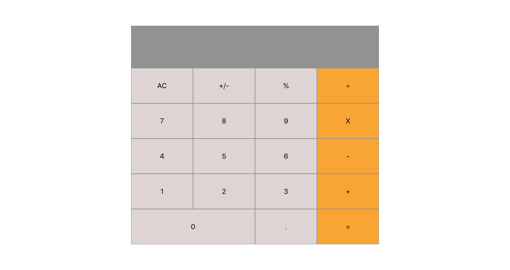

# React Calculator

[React Calculator](https://blissful-brattain-2ea0d8.netlify.com/) This is a small reactjs project that I'm building for the Microver JS course.


## Table of content

- [Description](#Description)
- [Installation](#installation)
- [Contact](#contact)

## Description

This is a small reactjs project that I'm building for the Microver JS course.

### Logic

Add Calculate logic for

- AC
- +/-
- All the math operations including modulo
- = operator
- numeric digits

## Installation

1. Clone the project to your local directory

```
git clone https://github.com/KaushikShivam/restaurant_page
```

2. The project uses NPM for managing dependencies. Run npm install to install all the required dependencies

```
npm install
```

3. Run the task runner to run the app

```
npm run start
```

## Contact

You can contact me at:

- [Portfolio](https://www.shivamkaushik.com)
- [Email](mailto:shivamkaushikofficial@gmail.com)
- [Linkedin](https://www.linkedin.com/in/kshivamdev/)
- [Twitter](https://twitter.com/kShivamDev)
- [Medium](https://medium.com/@shivamkaushikofficial)
- [Angellist](https://angel.co/kshivamdev)
